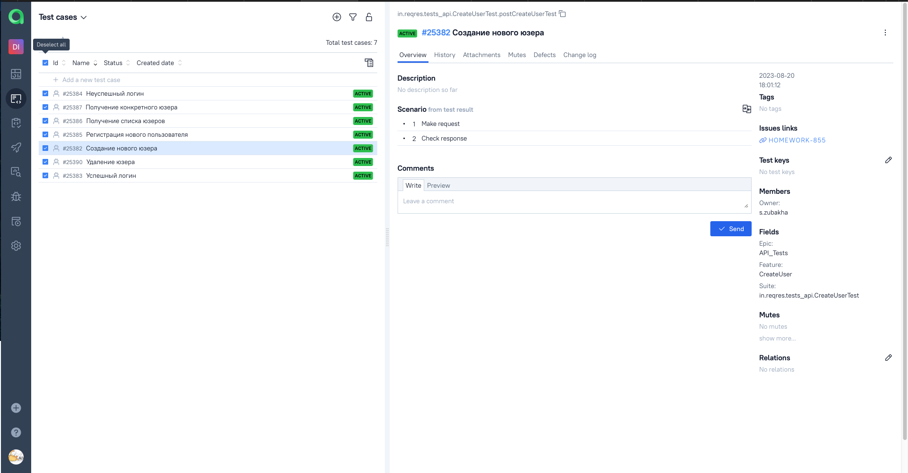
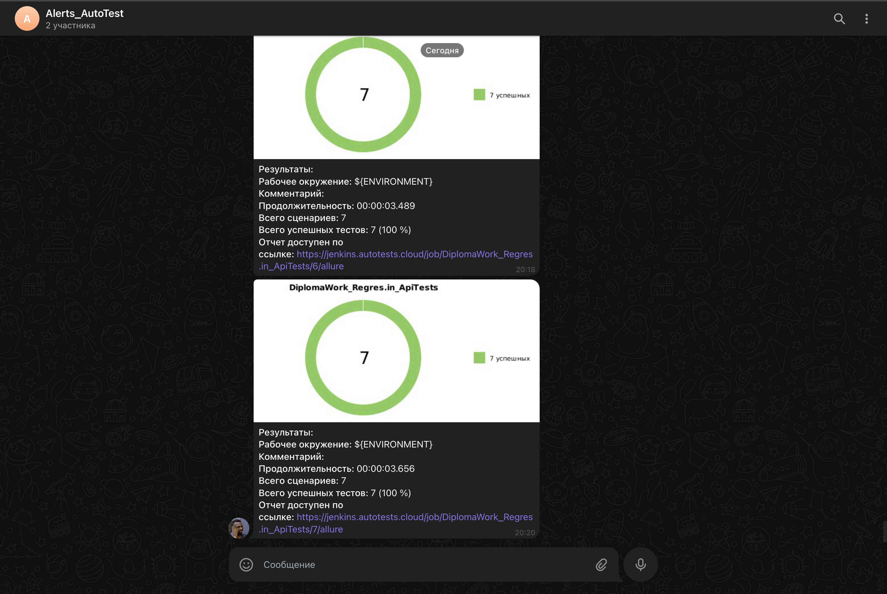

# Дипломный проект по автоматизации тестирования API сайта <a href="https://reqres.in/">Reqres.in</a></h1>

### Технологии и инструменты:
<p align="center">


</p>

### Реализованные тесты:
* Успешный логин юзером и проверка ответа
* Неуспешный логин и проверка ответа
* Создание нового юзера и проверка ответа
* Регистрация нового пользователя и проверка ответа
* Получение списка юзеров и проверка ответа  
* Получение конкретного юзера и проверка ответа

### Запуск тестов из терминала
#### Локальный запуск тестов:
```bash
gradle clean test
```

#### Удаленный запуск тестов с параметрами:

```bash
gradle clean test
```

### Запуск тестов в Jenkins
<a target="_blank" href="https://jenkins.autotests.cloud/job/DiplomaWork_Regres.in_ApiTests/">Сборка в Jenkins</a>
<p align="center">

</p>

### Отчет в Allure report
#### Основная страница отчета
<p align="center">

</p>

#### Тест-кейсы
<p align="center">

</p>

### Интеграция с Allure TestOps
#### Dashboard
<p align="center">

</p>

#### Тест-кейсы
<p align="center">

</p>

### Интеграция с Jira
<p align="center">

</p>

### Уведомления в Telegram с использованием бота
<p >
>По завершению тестов поступают уведомления в Telegram.
</p>
<p align="center">

</p>
